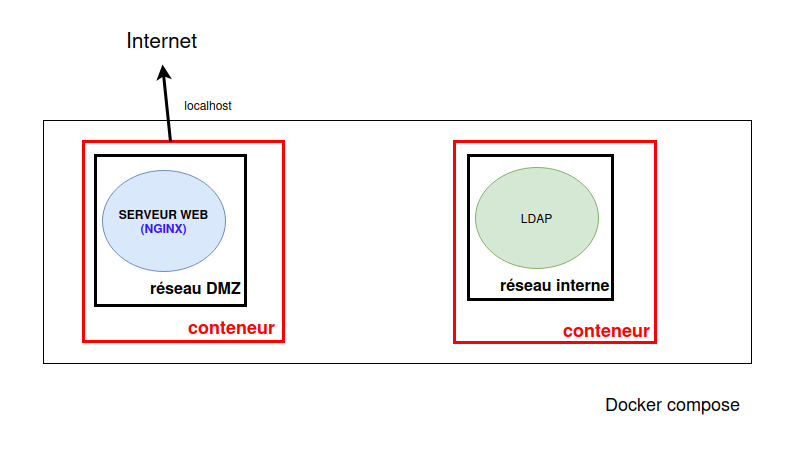
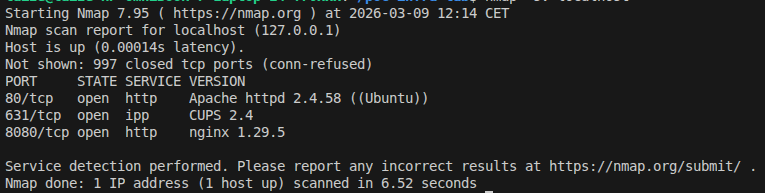

# POC de lab réseaux séucrisé

## 1. Introduction

Ce projet présente un mini laboratoire d’infrastructure utilisant Docker afin de simuler une architecture réseau simple.

L'objectif est de reproduire une petite infrastructure d'entreprise avec :
- un service web exposé
- un service interne d'authentification
- une segmentation réseau

Dans ce laboratoire, plusieurs services tournent dans des conteneurs séparés.

Les conteneurs sont placés sur des réseaux différents :
- une DMZ pour les services exposés
- un réseau interne pour les services sensibles

Ce type d'architecture est courant dans les infrastructures réelles.

---

## 2. Architecture

L'infrastructure est composée de deux services :

- un serveur web **NGINX**
- un serveur d'annuaire **OpenLDAP**

Le serveur web est placé dans une **DMZ** et exposé sur le port 8080.

Le serveur LDAP est placé dans un **réseau interne** et n'est pas accessible directement depuis l'extérieur.

---

## 3. Déploiement

L'infrastructure est définie dans le fichier :

docker-compose.yml

Ce fichier permet de définir :

- les images Docker utilisées
- les conteneurs à lancer
- les réseaux
- les ports exposés

### Lancement de l'infrastructure

docker compose up -d

Cette commande :

- télécharge les images nécessaires
- crée les réseaux Docker
- crée les conteneurs
- démarre les services

### Vérifier les conteneurs

docker ps

---

## 4. Test du serveur web

Le serveur web NGINX est accessible via :

http://localhost:8080

Cela confirme que le conteneur web fonctionne correctement.

---

## 5. Analyse de sécurité

Un scan réseau a été réalisé avec **Nmap** afin d'analyser les services exposés.

nmap -sV localhost

Résultats observés :

- port 80 : Apache (service local du système)
- port 631 : CUPS (service d'impression Linux)
- port 8080 : NGINX (conteneur Docker)

Le port **8080** correspond au serveur web exposé par le conteneur NGINX.

Cette analyse montre comment un scan réseau peut révéler les services exposés d'un système.

---

## 6. Segmentation réseau

Les services sont placés sur deux réseaux Docker distincts :

- **dmz_net** : contient le serveur web
- **internal_net** : contient le serveur LDAP

Cette segmentation limite l'exposition des services sensibles.

---

## 7. Perspectives d'amélioration

Plusieurs améliorations pourraient être ajoutées :

- ajout d'un firewall
- ajout d'un conteneur client pour simuler un attaquant
- analyse réseau plus avancée
- supervision et logs

---

## Arborescence du projet

poc-infra-lab
│
├── docker-compose.yml
├── README.md
├── architecture.png
└── screenshots
└── nmap_scan.png
